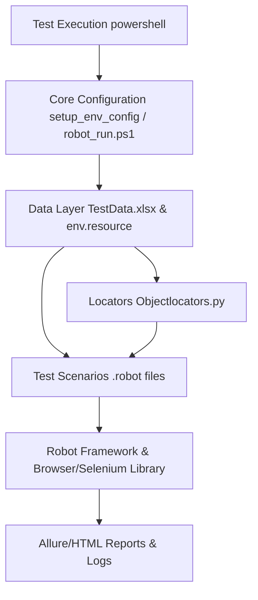
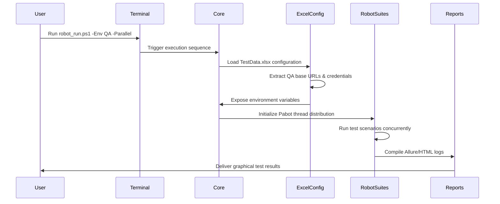
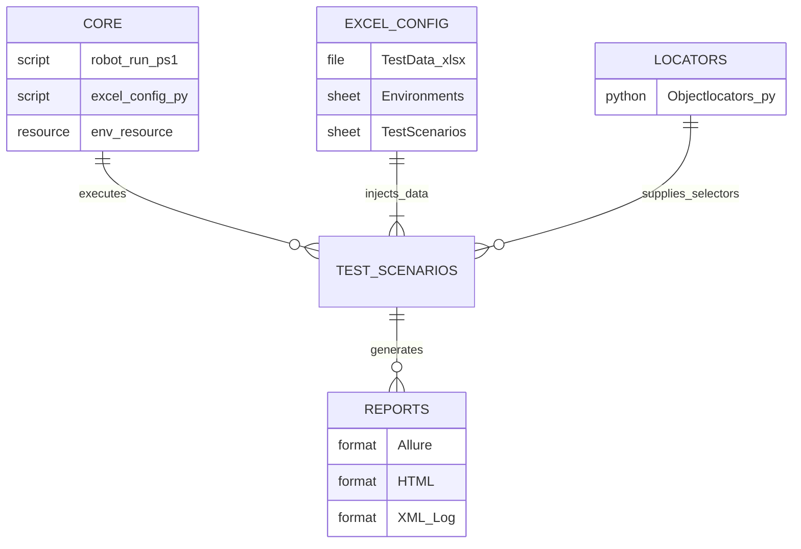

# Robot Framework Automation Suite

## Overview
Welcome to the modernized Robot Framework automation suite. This framework leverages robust Page Object Model (POM) methodologies, data-driven dynamic configurations using Excel, and scalable parallel execution using Pabot. It is designed to be highly maintainable, separating core logic from test data and test scenarios.

## Framework Architecture & Scope

The framework relies on a three-tier execution flow cleanly separating core logic, declarative data handling, and automation scripts:

### Architecture Diagram



### Execution Sequence Flow

The following diagram shows how a test run flows from user command through to final reporting:



### Component Relationship Diagram

Shows how the core, data, and locator layers are interconnected:



### Component Details

- **`core/`**: The execution engine. Houses `robot_run.ps1`, `excel_config.py`, and `env.resource`. 
- **`data/`**: The test data layer. Contains `TestData.xlsx`, which centralizes all environment mappings (URLs, browser settings, API credentials) and data across QA, DEV, and PROD.
- **`locators/`**: The Page Object repository. Contains `Objectlocators.py`, which generalizes all object UI maps (CSS/ID blocks) avoiding hardcoded parameters in tests.
- **Test Scenarios**: Your `.robot` files, keeping actual test implementation completely independent of data and configuration overhead.

## Key Features

- **Excel-Based Environment Configuration**: Replaces hardcoded logic. Environments (like DEV, QA, PROD) and test data are dynamically injected at runtime.
- **Centralized Locators (POM)**: Ensures test stability and simplifies maintenance by decoupling selectors from test scripts.
- **Scalable Execution**: Supports both sequential bulk test execution and multithreaded parallel execution to optimize testing time.
- **Advanced Reporting**: Features comprehensive error capture and reporting capabilities, outputting graphical matrices via Allure/HTML logs.

## Quick Execution Guide

All executions run through the core script `robot_run.ps1` to intelligently handle configuration loading and paths.

### 1. Run a Single Test
Run a specific suite mapped to a given environment (e.g., DEV):
```powershell
powershell -ExecutionPolicy Bypass -File .\core\robot_run.ps1 -TestFile "sp_BDD.robot" -Env DEV
```

### 2. Bulk Execution (Sequential)
Run all available modules sequentially, perfect for overnight end-to-end verifications (e.g., in PROD):
```powershell
powershell -ExecutionPolicy Bypass -File .\core\robot_run.ps1 -All -Env PROD
```

### 3. Parallel Execution
Distribute test scenarios autonomously using multithreading for rapid throughput (e.g., in QA):
```powershell
powershell -ExecutionPolicy Bypass -File .\core\robot_run.ps1 -Parallel -Env QA
```

---
*For a deeper dive into the architectural flow, sequence diagrams, and configuration setup, please refer to [`doc/ROBOT_ARCHITECTURE.md`](doc/ROBOT_ARCHITECTURE.md).*
