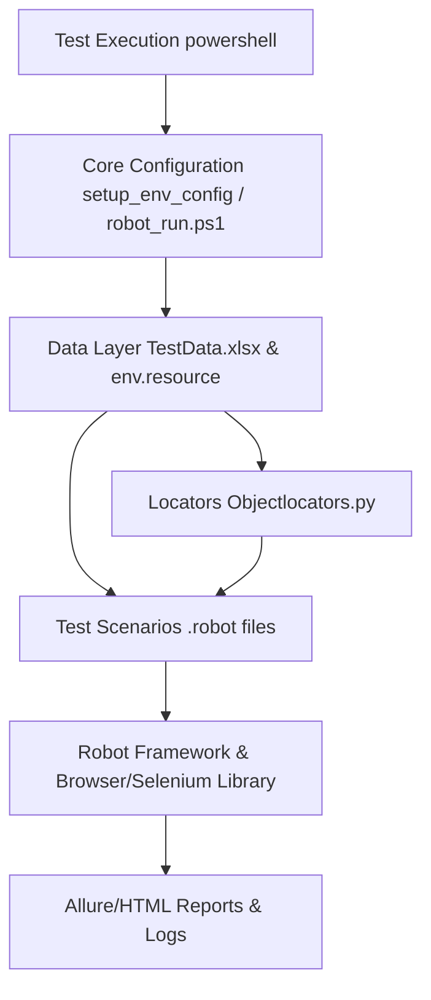
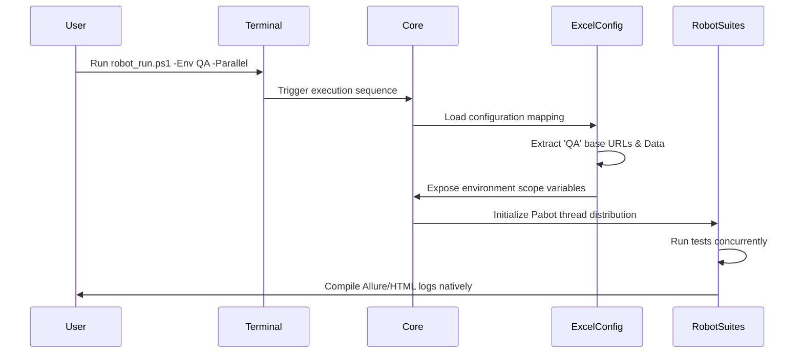
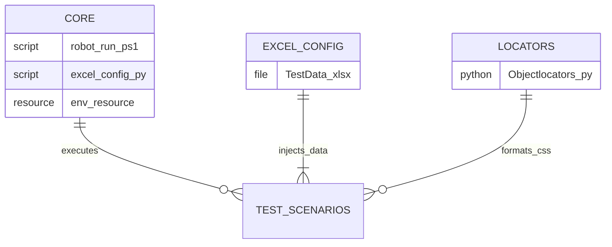

# Robot-Based Test Automation Framework

Welcome to the newly modernized Robot Framework automation suite documentation. This guide details the refactoring, architecture, and structural standards applied to centralize configurations, stabilize parallel executions, and adopt proper Page Object methodologies for dynamic test data management.

---

## Framework Architecture

The framework relies on a robust three-tier execution flow cleanly separating core logic, declarative data handling, and automation scripts.

### Architecture Diagram



### Flow Diagram



### Component Relationships



---

## Core Folder Consolidation Summary

To prevent pathing issues and abstract logic correctly:
- **`core/`**: We created a dedicated core layer housing `robot_run.ps1`, `excel_config.py`, and `env.resource`. 
- Executions intelligently leverage `$PSScriptRoot` pointing reliably across nested dependencies.
- **`data/`**: Consolidated all raw configurations and external testing references internally.
- **`locators/`**: Generalizes object maps cleanly avoiding hardcoded parameters.

---

## Excel-Based Environment Configuration

### Overview
The Robot Framework now natively supports **Excel-based environment configuration**. This replaces messy or hardcoded logic inside `.robot` files by pointing strictly to `data/TestData.xlsx`, establishing a centralized environment mapping (e.g., APP_URL, browser settings, API credentials).

### Dynamic Configuration Discovery
Using `core/excel_config.py`, as tests begin, dynamic configurations inject immediately through `env.resource`. By passing the `-Env DEV` argument to the executor wrapper, variables natively resolve against the target column located inside the Excel sheet at execution time. No manual changes are required per environment!

### Excel-Based Environment Configuration - Implementation Summary
We successfully implemented two utility sheets resolving testing loads natively:
- **Environments**: Extracts Base URLs, Browser types, timeouts, and API Keys dynamically.
- **TestScenarios**: Manages logical parameters per suite allowing data-toggling logic naturally using the `Active = YES` parameter mapping.

### Automatic Test Data Loading - User Guide

To interact natively with parsed configuration pools:

#### Get Specific Values
Within Robot Framework scenarios, values are seamlessly formatted. You simply inject Excel parameters directly inside Robot via global placeholders automatically retrieved from the wrapper setups.
```robot
*** Settings ***
Suite Setup    Load Environment Variables

*** Test Cases ***
Check Target URLs
    Log    Testing strictly against: ${BASE_URL}
    Log    With Database keys mapping to: ${API_PASSWORD}
```

#### Get All Data
To visually load and interrogate the entire loaded parameter list against your local CLI before test invocation, use the internal test manager script dynamically:
```powershell
python view_env_config.py
```
This extracts cleanly parsed CLI tables displaying every active target suite and parameter.

### TestDataManager - Summary
Behind the scenes, we've generalized Data Management via `setup_env_config.py`. It constructs robust `TestData.xlsx` skeletons automatically. The Data Manager dynamically controls scaling properties removing direct database ties away from standard logic files.

---

## Page Object Pattern - Common Approach Guide

### Overview
This framework uses a centralized approach for managing page objects across all test implementations. This ensures consistency, reduces code duplication, and makes it easy to add new pages utilizing the standard Python module structure `Objectlocators.py`.

### Before vs After

#### Before (Inconsistent Approach)
In legacy executions, locators were hardcoded directly within logic suites breaking reuse rules:
```robot
Enter Insurant Data
    Fill Text    id=firstname    Max
    Fill Text    id=lastname    Mustermann
    Check Checkbox    *css=label >> id=gendermale
```

#### After (Common Approach)
By loading the global python properties array `Variables ../locators/Objectlocators.py`, tests extract robust identifiers resolving across any logic suite seamlessly:
```robot
Enter Insurant Data
    Fill Text    ${FIRST_NAME_INPUT}    Max
    Fill Text    ${LAST_NAME_INPUT}    Mustermann
    Check Checkbox    ${GENDER_MALE_RADIO}
```

### Common Page Object Approach - Implementation Summary
All object dictionaries reside inside `locators/Objectlocators.py`. The design gracefully supports standard static CSS, ID blocks, and additionally dynamically interpolated mapping bindings resolving robot variables gracefully inside the python objects (e.g. `[value=${price_option}]`).

---

## Error Capture and Logging System
If execution limits are breached unexpectedly:
- Systematically leverages Pabot output capturing for distributed node tracing (logging `reports_pabot/`).
- Hardened HTML tracing via Browser library screenshots actively caching under `logs/`. 
- Global outputs directly pipeline into the overarching Allure command schema generating graphical matrices when `$Allure` variables hit truthy configurations natively via standard execution logging arrays!

---

## Test Execution Steps - Login Specification

Standard regression triggering occurs completely independently of logical implementations avoiding CLI bloat:

To trigger standard suites mapping Excel locators:
```powershell
# Standard Single Test Setup
powershell -ExecutionPolicy Bypass -File .\core\robot_run.ps1 -TestFile "sp_BDD.robot" -Env DEV
```

---

## Bulk Execution

Bulk Execution evaluates all available modules across the `testscenarios` pool sequentially. It is the preferred method for running thorough, end-to-end verifications over overnight automation pipelines without risking parallel database conflicts. 

### Core Topics Handled in Bulk
- Iterative script evaluation passing loaded environment configurations.
- Consolidated logging via the common global XML aggregator. 
- Fault-tolerant pipeline design ensuring suites complete sequentially.

### Execution Command
Trigger a full sequential bulk run natively:
```powershell
powershell -ExecutionPolicy Bypass -File .\core\robot_run.ps1 -All -Env PROD
```

---

## Parallel Execution

Through integration with the multithreaded `pabot` library, execution scaling distributes tests completely autonomously. The engine effectively slices queued scenarios mapped under the standard TestData limits and assigns threads to optimize resources dramatically pulling execution cycles down gracefully.

### Core Topics Handled in Parallelism
- **Pabot Engine Interception**: Instead of using Robot's standard library parser natively, Pabot evaluates scopes dynamically.
- PATH dynamic binding avoids Windows spacing constraints when resolving `$TestDir`.
- Asynchronous data processing ensures rapid throughput while safely merging fragmented Allure/HTML structures dynamically after logic completion.

### Execution Command
Trigger tests in multi-pooled autonomous Parallel distribution:
```powershell
powershell -ExecutionPolicy Bypass -File .\core\robot_run.ps1 -Parallel -Env QA
```

---

## Quick Configuration and Quick Reference

### Quick Reference: Excel Environment Configuration
- **Script Generation**: `python setup_env_config.py` (Resets data sheets natively)
- **Script Discovery**: `python view_env_config.py` (Prints targeted settings/suites)
- **Base Excel Map**: `data/TestData.xlsx` (Requires standard keys formatted: 'DEV', 'QA', 'PROD').

## Review the Robot Frameworks for python
Overall, the Python Robot architectural restructuring cleanly pivots rigid localized properties spanning test data boundaries, locator patterns, and sequential blockages entirely into generic scalable objects. Your regression suites natively scale horizontally and data drives dynamically aligning perfectly with modern CI automation guidelines.
